# Power Age

Минимальный Python-проект для исследования связи между возрастом правящей элиты и историческими событиями на примере России, СССР и РФ в 1801-2026 годах.

Это MVP, а не готовый академический датасет. Его цель - дать воспроизводимую структуру данных, расчеты и первые графики, которые можно расширять и методологически уточнять.

## Идея

Проект разделяет две шкалы возраста:

- `biological_age` - биологический возраст человека на конкретную дату.
- `political_age` - сколько лет человек находится внутри политического контура с момента `political_entry_date`.

Эти переменные не равны друг другу. Человек может быть биологически старым, но политически новым, или наоборот - сравнительно молодым, но давно встроенным в управленческую элиту.

## Данные

Стартовые CSV лежат в `data/raw`:

- `persons.csv` - базовые данные о людях: идентификатор, имя, дата рождения, дата смерти, происхождение.
- `positions.csv` - позиции во власти: период, институт, уровень, вес влияния, флаги `is_ruler` и `is_core_elite`.
- `political_entries.csv` - даты входа в политику, элиту и правящий круг.
- `events.csv` - исторические события: дата, тип, тяжесть, направление решения.
- `core_elite_groups.csv` - исследовательские правила отбора core elite по периодам.
- `sources_elite_addendum.csv` - навигационные источники для расширенного elite seed dataset.
- `core_elite_groups_early.csv` - правила отбора для Российской империи, 1917 года, раннего СССР, сталинского и хрущевского периодов.
- `sources_early_elite_addendum.csv` - источники для раннего elite seed dataset.

Многие значения `political_entry_date`, `elite_entry_date` и `ruling_circle_entry_date` в стартовом файле приблизительные и требуют ручной проверки.
События в `events.csv` дополнены слоем elite-initiated интерпретации:

- `elite_initiated` - событие как решение элиты или правителя;
- `initiator_type` - тип инициатора: ruler, government, party, security и т.д.;
- `initiator_person_id` - ключевой инициатор, если он есть;
- `initiator_group` - фракция или контур власти, если его можно указать;
- `confidence` - уверенность в такой трактовке;
- `decision_domain` - домен решения;
- `event_scope` - масштаб события.

Часть событий в этом слое является representative date или агрегированной датой процесса. Для них нужна ручная проверка источников.

## Установка

```bash
cd power_age_project
python -m venv .venv
source .venv/bin/activate
pip install -e ".[dev]"
```

## Запуск

Построить годовую таблицу:

```bash
python -m power_age.cli build
```

Результат сохраняется в `data/processed/elite_year.csv`.

Построить графики:

```bash
python -m power_age.cli plot
```

PNG-файлы сохраняются в `outputs/figures`.

Сейчас строятся:

- `ruler_age_timeline.png` - возраст правителя и события;
- `biological_vs_political_age.png` - биологический и политический возраст правителя;
- `core_elite_age.png` - средний и взвешенный средний возраст core elite;
- `core_elite_aging_dashboard.png` - dashboard: возраст, доли 60+/70+, renewal 5y, размер выборки;
- `ruler_vs_core_age.png` - возраст правителя против среднего возраста core elite;
- `institution_composition.png` - институциональный состав core elite по доле `influence_weight`;
- `period_age_boxplots.png` - распределение возраста core elite по периодам из `core_elite_groups.csv`.

## Графики

### Возраст правителя и события

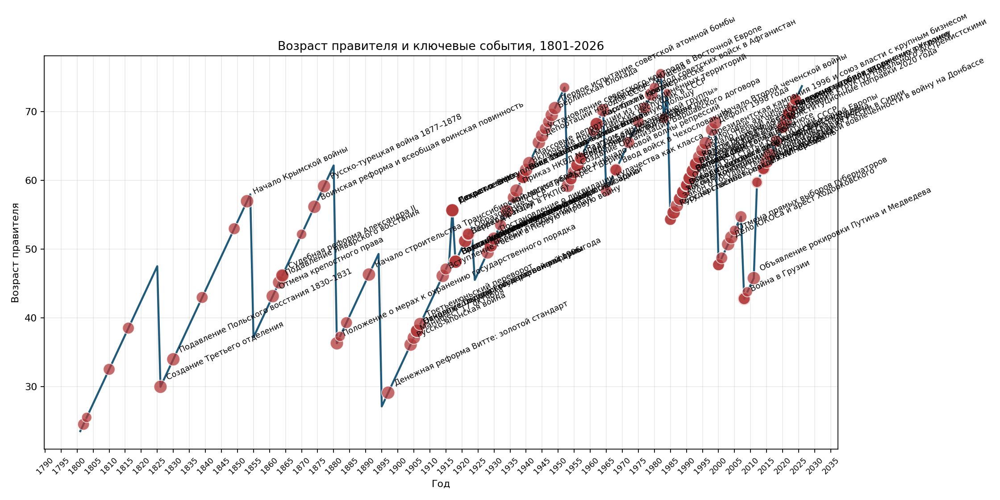

### Биологический и политический возраст правителя

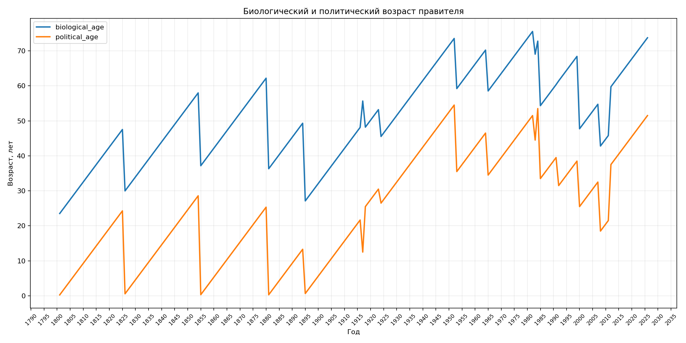

### Средний возраст core elite

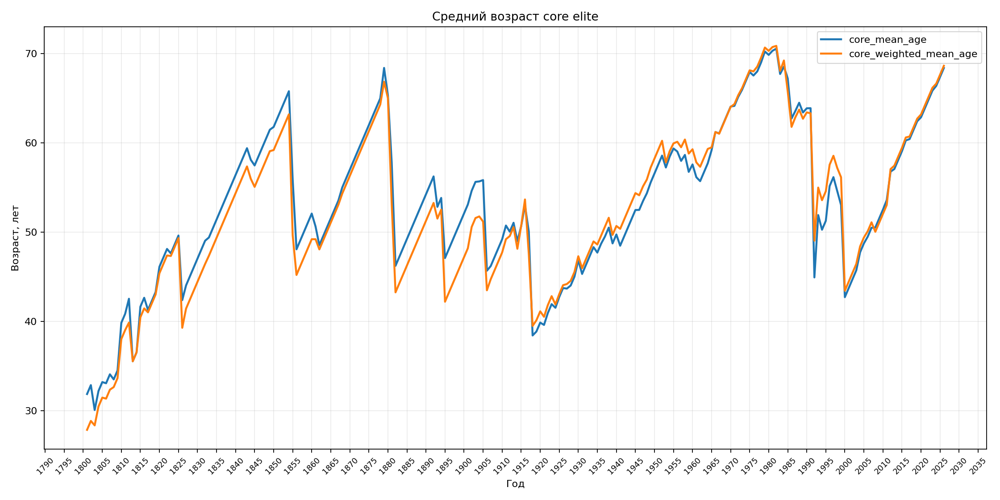

### Core elite aging dashboard

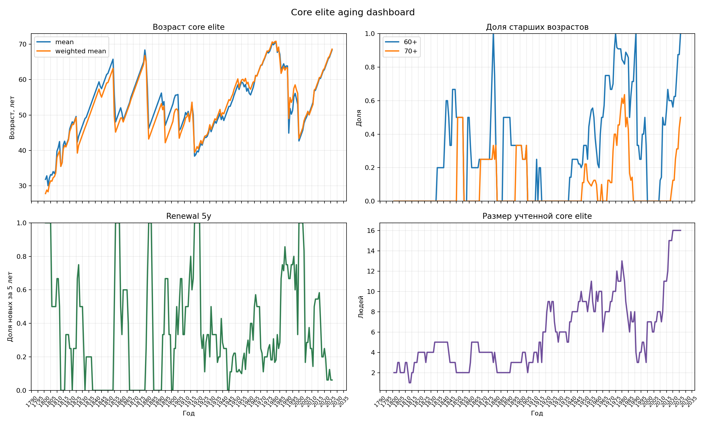

### Возраст правителя против core elite

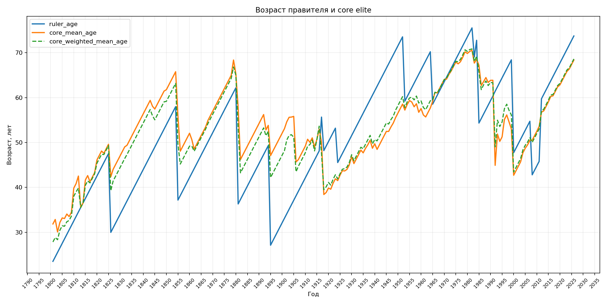

### Институциональный состав core elite

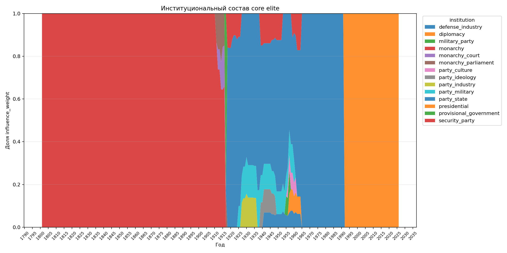

### Возраст core elite по периодам

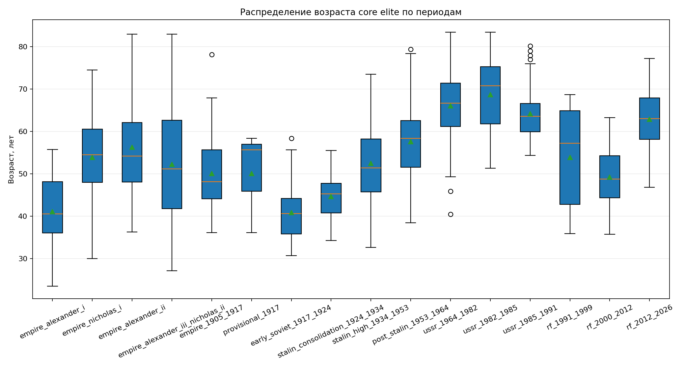

### Фракционная власть

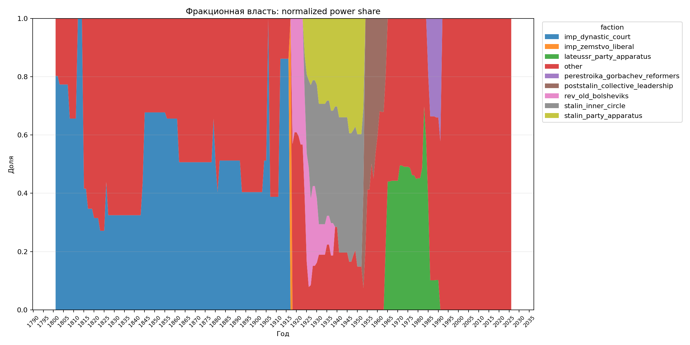

### Возраст фракций

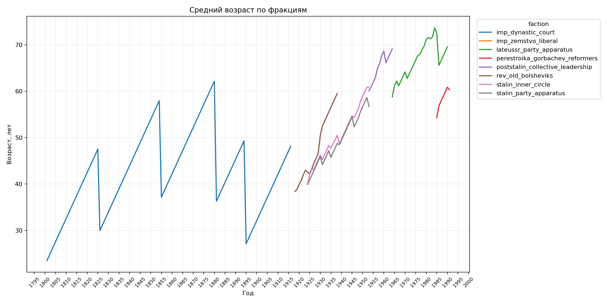

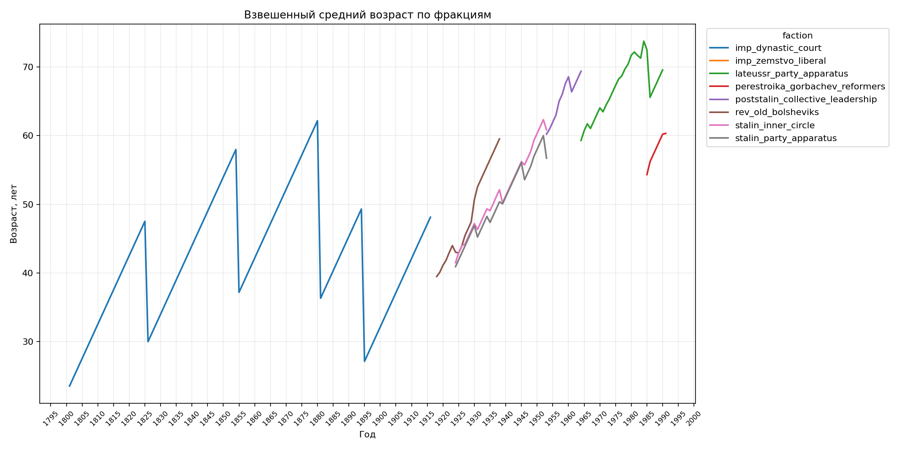

### Фрагментация и heatmap

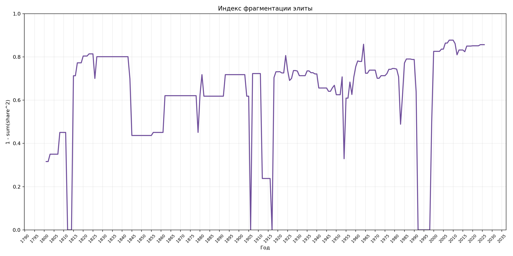

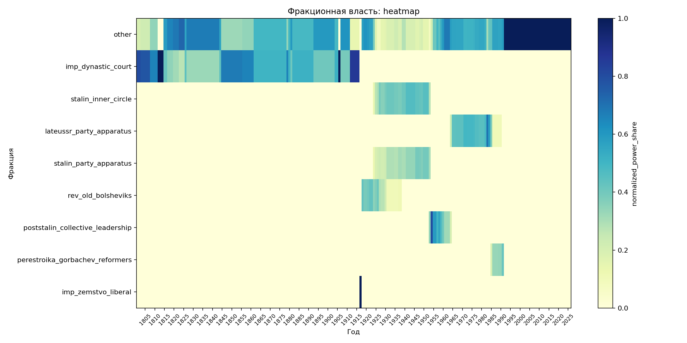

Вывести краткую сводку:

```bash
python -m power_age.cli summary
```

События:

```bash
python -m power_age.cli event-summary
python -m power_age.cli plot-events
```

## Тесты

```bash
pytest
```

## GitHub Pages

Для публикации статической версии:

1. Закоммить изменения и отправь репозиторий на GitHub.
2. Открой `Settings -> Pages`.
3. В `Build and deployment` выбери `Deploy from a branch`.
4. В `Branch` выбери `main` и папку `/docs`.
5. Сохрани настройки.

После публикации GitHub Pages будет показывать сайт из `docs/index.html`.
На странице есть переключатель `RU/EN`, блок с выводами по корреляциям,
событийный слой, кросс-табы и увеличение графиков по клику.

Если графики были перегенерированы, обнови копии для Pages:

```bash
cp outputs/figures/*.png docs/figures/
```

## Фракционный слой

Проект поддерживает слой фракций, сетей влияния и условных "башен". Это гипотетическая multilabel-модель, а не утверждение о формальном или доказанном устройстве власти.

Современный фракционный слой для РФ 1991-2026 и исторический фракционный слой 1801-1991 устроены по-разному. Нельзя механически переносить категории вроде `siloviki` или "башни Кремля" на Российскую империю, ранний СССР или сталинский период. Для сравнения эпох используется `faction_type`, а `faction_id` описывает конкретную историческую группу конкретного периода.

Примеры:

- `imp_bureaucratic_reformers` не равны `perestroika_gorbachev_reformers`, но обе группы можно анализировать как реформаторскую/идеологическую логику через `faction_type`.
- `lateussr_kgb_security` и `siloviki` не одно и то же, но обе категории относятся к security/institutional logic.

Файлы лежат в `data/raw`:

- `factions.csv` - справочник фракций и сетей;
- `person_factions.csv` - привязка людей к фракциям;
- `faction_relations.csv` - гипотетические отношения между фракциями;
- `elite_edges.csv` - гипотетические связи человек-человек;
- `sources_factions.csv` - источники и навигационные ссылки;
- `faction_model_config.json` - описание рекомендуемых формул.
- `historical_faction_model_config.json` - методологические предупреждения для исторического слоя.

Один человек может входить в несколько фракций. Поле `confidence` показывает уверенность в привязке от 0 до 1. По умолчанию расчеты используют `min_confidence=0.5`.

Фракционная власть считается как:

```text
faction_person_power = influence_weight * confidence
```

В таблице `data/processed/faction_year.csv` есть две доли:

- `raw_power_share` - доля относительно общего веса core elite за год. Из-за multilabel-принадлежности сумма по фракциям может быть больше 1.
- `normalized_power_share` - доля относительно суммы фракционных power за год. Сумма по фракциям равна 1.

Индекс фрагментации:

```text
fragmentation_index = 1 - sum(normalized_power_share^2)
```

Чем выше индекс, тем менее концентрирована фракционная власть в одной доминирующей группе.

Команды:

```bash
python -m power_age.cli diagnostics
python -m power_age.cli build-factions
python -m power_age.cli plot-factions
python -m power_age.cli faction-summary
```

Фракционные processed-файлы:

- `data/processed/faction_year.csv`
- `data/processed/faction_type_year.csv`
- `data/processed/faction_fragmentation.csv`
- `data/processed/events_with_faction_context.csv`

Фракционные графики:

- `faction_power_share_stacked.png`
- `faction_type_power_share_stacked.png`
- `faction_mean_age.png`
- `faction_weighted_mean_age.png`
- `faction_fragmentation.png`
- `faction_power_heatmap.png`
- `factions_empire_1801_1917.png`
- `factions_revolution_1917_1924.png`
- `factions_stalin_1924_1953.png`
- `factions_poststalin_1953_1964.png`
- `factions_lateussr_1964_1985.png`
- `factions_perestroika_1985_1991.png`
- `factions_rf_1991_2026.png`

Событийные processed-файлы:

- `data/processed/events_with_faction_context.csv`

Событийные графики:

- `events_by_year.png`
- `events_by_period.png`
- `events_by_domain.png`
- `event_severity_timeline.png`

Фракционные принадлежности требуют ручной проверки источников и sensitivity analysis. Они являются исследовательскими аннотациями, а не фактом.

## Elite Addendum

Проект подключен к двум стартовым аддон-датасетам:

- `power_age_early_elite_addendum` - Российская империя, 1917 год, ранний СССР, сталинский и хрущевский периоды.
- `power_age_elite_addendum` - поздний СССР и РФ.

Они расширяют базовые CSV людьми из министерской бюрократии, двора, Политбюро, Совмина, силового блока, администрации президента, Совбеза, правительства, МИД, ЦБ и других частей ядра власти.

Скрипт подключения лежит в `scripts/append_elite_addendum.py`:

```bash
python scripts/append_early_elite_addendum.py ../power_age_early_elite_addendum --project-dir .
python scripts/append_elite_addendum.py ../power_age_elite_addendum
```

Аддон использует curated influence intervals: строка в `positions.csv` означает не каждую формальную должность отдельно, а период, когда человек считается частью реального ядра власти для MVP-расчетов.

## Что уже считается

- возраст правителя на 1 июля каждого года;
- политический, элитный и ruling-circle возраст правителя;
- должностной возраст правителя;
- численность core elite;
- средний, медианный и взвешенный средний возраст core elite;
- доля core elite старше 60 и 70 лет;
- стандартное отклонение возраста;
- `renewal_5y` - доля core elite, вошедших в элиту за последние 5 лет;
- сводка событий по годам.

## Методологические ограничения

В стартовом MVP `core elite` определяется простым флагом в `positions.csv`. Для Российской империи, СССР и РФ реальный состав элиты должен определяться по разным институциональным правилам: монархический двор и министры, партийные органы, политбюро, Совбез, администрация президента, правительство и другие группы требуют отдельных критериев.
